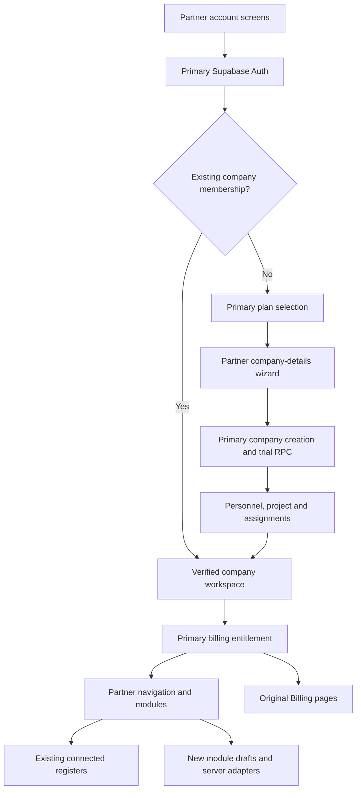

# Integration design

The original ProjectMatrix app owns identity, company membership, billing and subscription entitlement. The partner Project_Matrix app supplies the interface and expanded operational modules. There is one authenticated workspace and one subscription boundary.

## Source ownership

| Area | Integration choice |
| --- | --- |
| `src/App.tsx` | Primary workspace, entitlement refresh and onboarding orchestration with partner routes |
| `src/contexts/AuthContext.tsx` | Primary real Supabase session; partner-compatible methods and workspace bridge |
| `src/components/auth/` | Partner screens; account/company submissions call the primary workflow |
| `src/components/layout/` | Partner shell, with original entitlement banners and outlet flags |
| `src/pages/Billing/` | Original primary files, unchanged |
| `src/services/billingService.ts` and `paystackService.ts` | Original primary files, unchanged |
| `src/utils/billingUiHelpers.ts` | Original primary file, unchanged |
| `src/config/roles.ts`, `permissions.ts` | Partner granular operational role definitions |
| `src/config/accessControl.ts` | Primary billing checks retained, plus compatibility exports for partner components |
| `src/integration/` | Workspace permission checks, route policies, mutation guards, scoped draft storage and integration tests |
| `server.ts` and `server/` | Partner Express APIs with verified Supabase session, tenant, project and entitlement checks |
| `supabase/` | Primary migrations and Edge Functions retained; no deployment performed |

## Account and billing sequence

Sign-up creates a real Supabase account. If email confirmation is required, the user confirms it before continuing. A verified session enters the existing plan-selection flow. The partner's company-details wizard sends core company fields to the primary company-creation handler, which creates the original membership and calls `start_billing_trial`.

A failed trial initialization retains the company ID for retry; it does not create another company on each retry. A per-user browser checkpoint keeps incomplete onboarding in its workflow. After trial initialization the original personnel, project and assignment steps remain. `finalize-onboarding` completes the existing setup process.

Partner fields outside the supplied company schema (such as departments, operating settings and richer addresses) remain per-user company display drafts. They cannot override IDs, membership or subscription fields. Shared persistence for these extra fields is part of the next stage.

QR sign-in and local invitation redemption are not connected identity providers. QR UI explains its status. Partner invitation generation is a draft; it does not send email or create a verified company member. The original `create-company-member` workflow remains available. Simulated sessions and stored plaintext credential authentication are disabled.

## Roles and subscriptions

Operational pages use partner role definitions matched to the user's verified active company-member record. Direct links and menu visibility use shared route policies. Specialist tabs use their own module permissions. Company/project changes remount operational pages after the new access context is installed.

Billing access still checks the original raw member role/designation: CEO, COO, CFO, Director, Project Manager or Company Administrator, with the original normalization rules. A general administrator flag or an expanded role such as Finance Manager does not by itself grant Billing access. Existing aliases such as CFO can map to a partner operational role while retaining the original billing eligibility from the member record.

An unknown, loading or mismatched entitlement blocks operational writes. Read-only subscriptions block changes; permitted billing recovery remains accessible. Existing Supabase RLS and RPC checks remain the authority for connected data. Browser permissions are interface controls; they are not a substitute for the backend policies still needed for new modules. Browser permission drafts do not grant effective application permissions.

## Data behavior

| Area | Current behavior |
| --- | --- |
| Accounts, membership, company creation, trial and billing | Existing primary Supabase integration |
| Procurement & Inventory and Accounts Register menu entries | Existing connected services retained; some inherited page-level caches remain |
| Original reports, site-diary register, documents and Advisor V2 | Retained routes and primary backend contracts where supplied |
| New commercial workspace, resources, contracts, risks, site hub, dashboards and additional administration panels | Partner frontend behavior; mixed sample, browser draft and connected data depending on module |
| Programme planning | Partner engine and browser project storage; authenticated server import/analysis APIs |
| Engineering RFI server | Authenticated tenant/project-scoped local JSON store under `data/`; not a shared production database |
| Rich company settings | Browser display drafts until backend extension |
| QR sign-in, invitation delivery/redemption, effective custom-role management | Require the next backend stage |

Browser records are scoped by verified user and company; project records also use project keys. These drafts are not a migration of either user's real data and do not synchronize across users, browsers or devices. Included samples must be reviewed before operational use. Preview notices identify mixed-data module areas.

## Source cleanup

The ZIP keeps one npm lockfile. A duplicate trial migration and redundant source migration copies are retained under `docs/source-archive/` rather than the executable migration directory. Obsolete public source snapshots were moved there as well. The original ZIPs were not modified.

The Paystack webhook TypeScript discriminant checks were adjusted for the combined TypeScript configuration without changing their runtime decisions. Selected inherited tests were updated to match the payment contracts already present in the primary code, including explicit auto-renew preferences and recovery reconciliation requirements. No payment behavior was changed to make tests pass.
